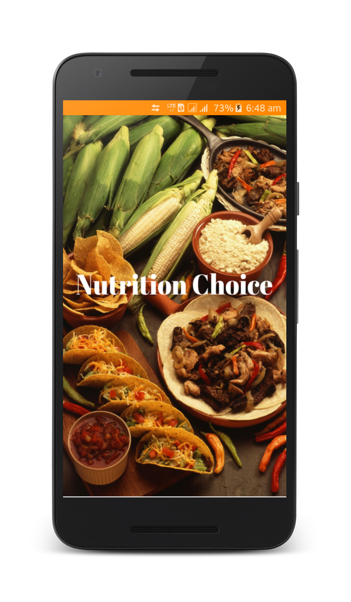
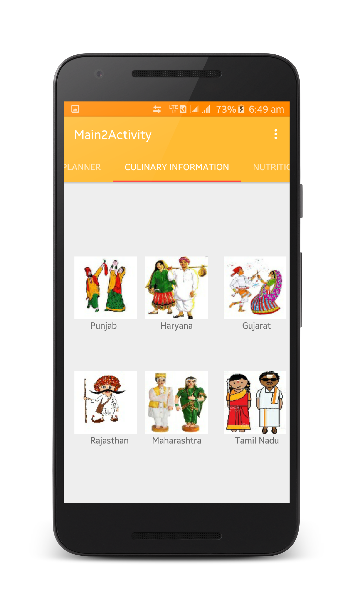

# Nutrition Choice
 World Food India Hackathon 2017 : Ministry of Food Processing Industries

### Problem Statements:
  (a) Nutritional status of food & dietary requirement  
  (b) Regional Culinary Information from various parts of the country  
  (c) Reducing food wastage

### Solution
Nowadays food consumers are very health conscious. Different gender and age groups have different nutritional requirement profile and it is not possible for each and every person to consult doctor or dietician to decide their food dietary requirement. So an Android application that can show dietary requirement of the user and also gives information about nutritional status of different food will help to this problem.

Nutrition Choice is an Android application which will provide details of nutritional profile of the different types of food and food products. It will also allow a user to select food product as per his/her budget and as per his/her nutritional requirements. App will also provide information on all the major culinary methods in practices all over India. Recipes and and videos related to them will also be shown in this app.

#### Key Features

##### 1. Nutrition value search:
- search by keywords like food or ingredient name 
- search by picture of food 

##### 2. Plan your nutrition:
- check nutrition requirement as per your age and gender 
- prepare your own diet chart for a week or a month as per cost and nutrition value 
- tracking calories intake/day or week graphically 

##### 3. Regional Culinary Information:
- Information regarding different dishes, customs or tradition from different states 
- Recipes of food category wise 
- Nutrition value of each recipe 
- Resources like youtube videos will be shown for recipe of different dishes 

##### 4. Reduce food wastage:
- Shows information of extra food products their expiry dates in godowns and departmental stores & provide the needy BPL families, NGO and for calamity affected areas with these products to prevent food wastage. 

### Screenshots
 
